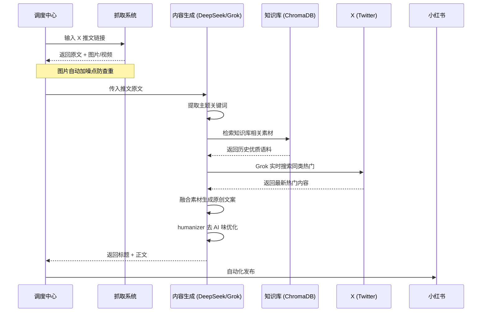

# X-to-XHS 内容搬运与发布工具

将 X (Twitter) 内容搬运至小红书的自动化工具，支持单条处理、批量处理、定时任务等多种模式。

---

## 功能概述

1. **内容抓取**：从 X 抓取推文原文、图片、视频及互动数据
2. **内容生成**：支持两种生成模式
   - 改写模式：基于 DeepSeek 将推文改写为小红书风格
   - 搜索增强模式：结合 Grok 实时搜索 + 本地知识库生成原创内容
3. **图片处理**：自动下载原图并进行防查重处理（加噪点、裁边）
4. **自动发布**：通过 Chrome 浏览器自动化发布到小红书
5. **知识库**：支持将优质推文存入本地 ChromaDB 向量数据库，供后续生成参考

---

## 工作流程

### 搜索增强模式流程



---

## 系统架构

```
X (Twitter)  -->  抓取系统  -->  内容生成  -->  发布器  -->  小红书
                         |
                         v
                   本地知识库 (ChromaDB)
```

### 核心模块

| 文件 | 功能 |
|------|------|
| `pipeline.py` | 主流程调度 |
| `scraper.py` | X 内容抓取 |
| `poster.py` | 小红书发布 |
| `generator.py` | AI 内容生成 |
| `knowledge_base.py` | ChromaDB 知识库 |
| `discovery.py` | 推文自动发现 |
| `scheduler.py` | 定时任务 |

---

## 快速开始

### 1. 安装依赖

```bash
pip install -r requirements.txt
```

### 2. 配置

复制配置模板：

```bash
cp config.example.py config.py
```

编辑 `config.py`，核心配置项：

| 配置项 | 说明 |
|--------|------|
| `CHROME_USER_DATA_DIR` | Chrome 用户数据目录（复用登录态） |
| `GROK_API_KEY` | Grok API Key（搜索增强模式必需） |
| `LLM_API_KEY` | DeepSeek/OpenAI API Key（内容生成必需） |

### 3. 使用方式

#### 单条处理
```bash
python run.py https://x.com/user/status/1234567890
```

#### 批量处理
```bash
python run.py --file urls.txt
```

#### 离线测试（不发布）
```bash
python run.py https://x.com/user/status/1234567890 --scrape-only
```

#### 全自动模式
```bash
python run.py --auto
```

#### 搜索增强模式（根据主题生成）
```bash
python run.py --hybrid "减脂早餐食谱"
```

#### 知识库管理
```bash
# 入库推文
python run.py --ingest --file urls.txt
# 查看统计
python run.py --kb-stats
```

---

## 配置说明

### 搜索增强模式

将 `HYBRID_MODE_ENABLED` 设为 `True` 开启。该模式下：
1. 提取推文主题关键词
2. 使用 Grok 搜索 X 上同类热门内容
3. 检索本地知识库参考
4. 生成小红书风格原创文案
5. 集成 humanizer 去 AI 味优化

### 自动发现

在 `config.py` 中配置 `DISCOVERY_NICHES` 设置搜索关键词：

```python
DISCOVERY_NICHES = [
    'cute cat filter:images min_faves:500',
    'cafe aesthetic filter:media min_faves:200',
]
```

---

## 防封注意事项

1. 使用 `CHROME_USER_DATA_DIR` 复用登录态，避免触发验证码
2. 批量发布时设置 `BATCH_DELAY_MIN` >= 30 秒
3. 图片防查重处理（加噪点、裁边）请保持开启

---

## 技术栈

- Python 3.10+
- Playwright（浏览器自动化）
- ChromaDB（向量数据库）
- DeepSeek / Grok API
- twscrape（X 数据抓取）