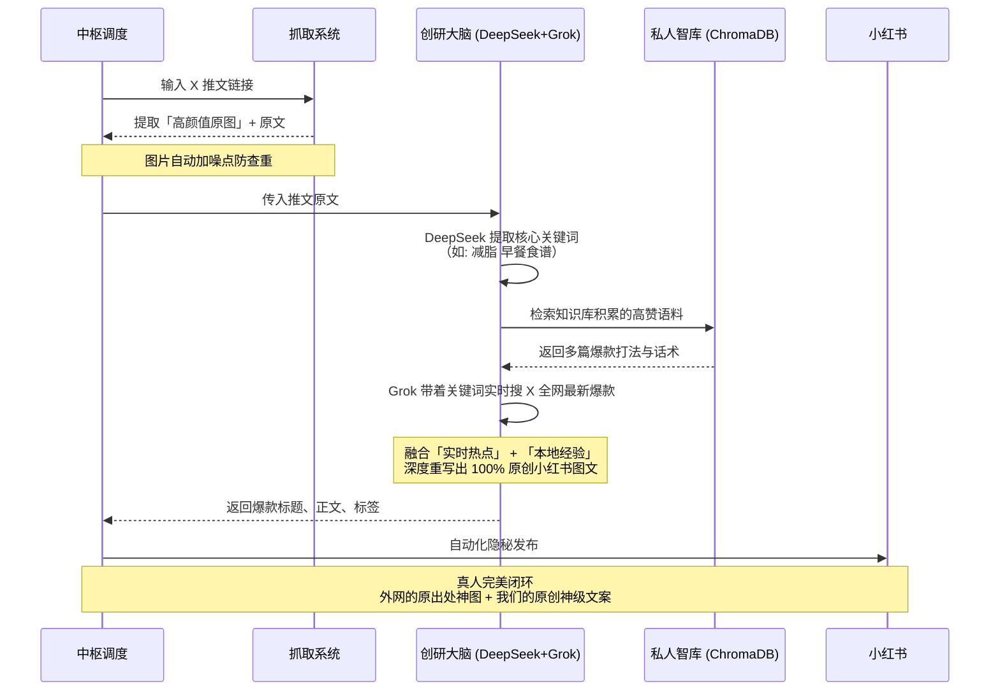
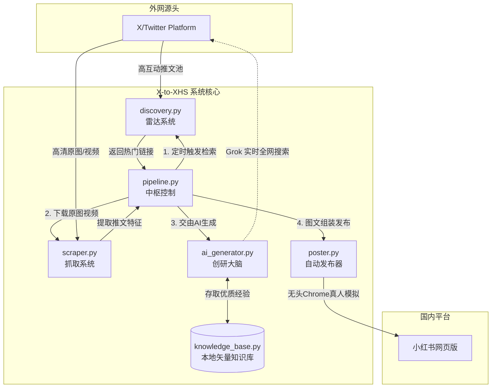

# X-to-XHS 自动搬运与原创爆款生成器

从 X (Twitter) 自动发现高赞内容，基于**“移花接木”**混合模式（真实图片抓取 + Grok 实时全网搜索 + 本地私有知识库）全自动生成 100% 原创的高质量小红书爆款笔记。

支持**单条/批量处理**、**全自动发现推文**、**AI选品评分**、**自动定时发布**。

---

## 🌟 核心特色：独创的“移花接木”混合模式

在小红书，纯 AI 生成的配图由于“塑料感”极易导致零流量。本项目采用最强解法：

1. **真实神图抓取**：自动抓取 X 上的极品生活感/视觉系原图，并进行防去重处理。
2. **Grok 实时核动力**：提取推文话题后，调用 Grok 4.1 Fast Reasoning 接口，**实时在 X 全网搜索最新 8 篇同类爆款**。
3. **私有化知识库 (RAG)**：自动检索本地 ChromaDB 知识库中过去表现优异的优质语料。
4. **终极融合**：拿别人的神仙美图，配上 Grok 融合全网最新痛点写出的 100% 原创文案，实现降维打击。

### 工作流演示




---

## � 系统架构

系统由 6 大核心模块组成：



**模块职责说明：**

- **`discovery.py` (雷达系统)**：基于 `twscrape` 日夜巡回搜索 X 上的高赞推文（可自定义 niche，如美食、穿搭）。
- **`scraper.py` (抓取系统)**：无头下载高清原图/视频，提取互动数据。
- **`ai_generator.py` (创研大脑)**：执行 AI 爆款打分、话题提取、Grok 实时搜索、合并大模型生成原创笔记。
- **`knowledge_base.py` (私人智库)**：基于 ChromaDB，把优质发帖经验存为本地向量资产。
- **`poster.py` (自动发布器)**：通过隐藏特征的 Chrome 浏览器操控小红书网页版实现真人模拟发布。
- **`pipeline.py` (中枢控制)**：串接上述齿轮，控制单条、批量、定时的全生命周期。

---

## 📦 快速开始

### 1. 安装依赖

> **注意**：程序需要 Python >= 3.10

```bash
pip install -r requirements.txt
```

### 2. 配置环境

复制配置模板并修改：

```bash
cp config.example.py config.py
```

编辑 `config.py`，核心必须配置的项：

| 模块 | 配置项 | 说明 |
|------|--------|------|
| **基础配置** | `CHROME_USER_DATA_DIR` | 复用现有的 Chrome 登录态（防红盾必备） |
| **混合生成 (必须)** | `GROK_API_KEY` | Grok (xAI) 的 API Key（推荐使用 OhMyGPT 中转） |
| | `GROK_MODEL` | 模型名称，如 `grok-4-1-fast-reasoning` |
| | `HYBRID_MODE_ENABLED` | **核心开关**：设为 `True` 开启“图文移花接木”混合模式 |
| **评分/打底模型** | `LLM_API_KEY` | 用于推文内容打分和基础重写（如 DeepSeek/OpenAI） |
| **自动发现** | `TWSCRAPE_USERNAME` | X 账号用户名及密码（用于登录 twscrape 搜索库）|

### 3. 使用方式 (CLI)

#### 🎯 单条处理（最常用）
输入一条推文链接，系统会自动：抓图 -> 提词 -> Grok实时查热门 -> 生成原创文 -> 自动发小红书。
```bash
python run.py https://x.com/user/status/1234567890
```

#### 📁 批量处理 (挂机模式)
读取 `urls.txt` 里的链接，自动带随机延迟（默认 30-90 秒）进行批量处理和发布，支持断点续传。
```bash
python run.py --file urls.txt
```

#### 🧪 离线测试提取 (不发布)
测试混合模式效果，只存图和生成文案到终端，不打开浏览器发小红书。
```bash
python run.py https://x.com/user/status/1234567890 --scrape-only
```

#### 🤖 全自动印钞机 (完全托管)
按 `config.py` 中的频率，自己去推特搜 -> 自己过滤 -> 移花接木重写 -> 自己发布。全自动运行。
```bash
python run.py --auto
```

#### 🧠 无中生有模式 (纯文本生成)
没有推特图片，只想根据一句话让 Grok 搜索现编一篇笔记。
```bash
python run.py --hybrid "今天北京的雪真大，适合吃铜锅涮肉"
```

#### 📚 知识库管理
将历史优秀的帖子链接归档入本地 ChromaDB 知识库，供 AI 后续“抄作业”时参考。
```bash
python run.py --ingest --file excellent_posts.txt
python run.py --kb-stats
```

---

## 🛠 高级：推文自动发现 (Niche) 设定

在 `config.py` 中的 `DISCOVERY_NICHES` 自定义 X 高级搜索语法，让雷达精准锁定赛道：

```python
DISCOVERY_NICHES = [
    # 宠物赛道
    'cute cat OR cute dog filter:images min_faves:500 lang:en',
    # 美食 OOTD 赛道
    '"cafe aesthetic" OR "what I eat in a day" filter:media min_faves:200 -filter:replies',
]
```

## ⚠️ 防封与安全须知

1. **环境隔离**：千万不要使用无头浏览器 (headless) 发小红书，必定触发验证码。必须使用配置好的 `CHROME_USER_DATA_DIR`。
2. **频率控制**：批量发布时，请保持 `BATCH_DELAY_MIN` 等于 30 秒以上，模拟真人操作节奏。
3. **查重对抗**：代码内置了图片 `add_noise` 和黑边裁切，这非常重要，绝不能关闭。
4. **账号限制**：`twscrape` 使用的是 X 内部的 gql 接口，单账号短时间内高频搜索偶尔会触发 15 分钟临时限速。

> **免责声明**：本项目仅供学习 LLM RAG、RPA 自动化工程及 Python 爬虫技术交流，请遵守相关平台的社区使用规范。
